<div align="center">



# 📦 projdump

**Your whole codebase. One file. AI-ready.**

Dump an entire project — tree, sources and stats — into a single Markdown, XML or JSON file,
ready to paste into **Claude**, **ChatGPT**, **DeepSeek**, **Gemini** or any LLM.

[](https://github.com/CheginiSoroush/projdump/actions/workflows/ci.yml)
[](LICENSE)
[](https://www.gnu.org/software/bash/)
[](test/)
[](.shellcheckrc)
[](CONTRIBUTING.md)
[](https://cheginisoroush.github.io/projdump/)
[](https://cheginisoroush.github.io/projdump/#playground)

**English** · [فارسی](README.fa.md)

</div>

---

> [!TIP]
> 🌐 **Interactive documentation & command builder:** [cheginisoroush.github.io/projdump](https://cheginisoroush.github.io/projdump/)
>
> انتشار صفر تا صد و جذب بازدید: [docs/GOING-LIVE.md](docs/GOING-LIVE.md)

## 🎬 See it in action

<div align="center">

</div>

## 🤔 Why?

Chatbots get smarter when they see **the whole picture**. But copy-pasting a codebase folder
by folder is slow, lossy and clumsy. `projdump` fixes that with **one command**:

- 🌳 the **directory tree**, every **source file** with correct syntax tags, plus a **summary** —
- in **one file** sized to your **token budget**, in the format your model likes best,
- generated **100% locally** — your code never touches anyone's server.

No dependencies beyond `bash`, `find` and `git`. `file`, `tree`, `jq` and `python3` are used
when present and gracefully skipped when not.

## ✨ Features

- 🌳 Directory tree — `tree(1)` if installed, a built-in fallback otherwise
- 🎨 Language tags from 120+ file extensions (Markdown / XML highlighting)
- 🧩 `--ext-only sh,py`, repeatable `--exclude` **and** `--include`
- 📏 `--max-size` with byte-accurate comparison
- 🚫 Binary detection with a fast extension path (no `file(1)` fork for media)
- 🎯 Three formats: **Markdown**, **XML** (Claude-friendly `<file>` blocks), **JSON**
- 🔍 `--list` dry run — preview exactly what would be dumped
- ✂️ `--since REF` — dump only what changed since a git ref
- 💰 `--tokens-budget N` — stop adding files once the (estimated) budget is reached
- 🔀 `--sort name|size|size-desc|ext` — control the file order
- 📝 `--note` — inject a "note for the AI" block at the top of the dump
- 🗂️ Language breakdown + largest-files table in the summary
- 🌿 Git metadata in the header (`main @ a1b2c3d (dirty)`)
- 📋 Auto clipboard copy (`pbcopy` / `wl-copy` / `clip.exe` / `putclip` / `xclip` / `xsel`)
- 📊 Summary with file count, lines, size and a rough token estimate
- 🛡️ Safe fences and CDATA escaping — a dump can never break itself
- ⚡ Uses `git ls-files` in repos, so `.gitignore` is respected
- 🩺 `--verbose` — explains exactly why each file was skipped
- 🌐 [Bilingual docs site](https://cheginisoroush.github.io/projdump/) — interactive command builder, ⌘/Ctrl+K search (49 entries incl. every flag, recipe and playground preset), a cookbook of copy-paste recipes (with *Copy all* / *Download .sh* one-clicks, per-recipe 🔗 copy-link buttons and shareable `?recipe=RX` / `#recipe=RX` deep links that auto-run the recipe on load), a **simulated terminal playground** (try the CLI in your browser, nothing to install — hit **▶ demo** for a hands-free run or **⬇ transcript** to save the session), a `?` keyboard-shortcuts cheat sheet, a downloadable cheat sheet, and a token-estimator widget (English + فارسی, dark/light)

## 🚀 Quick start

```bash
git clone https://github.com/CheginiSoroush/projdump.git
cd projdump
./install.sh
exec $SHELL          # or: source ~/.bashrc
```

`install.sh` symlinks `projdump.sh` into `~/.local/bin` (override with `--prefix /usr/local`)
and installs bash + zsh completions. Nothing is copied except the completion files, so
`git pull` updates your install.

> ▶ **Impatient?** [Try projdump in your browser](https://cheginisoroush.github.io/projdump/#playground) —
> a simulated terminal with the same flags and output shapes, nothing to install.

## 🎯 Usage

```bash
cd ~/my-project

projdump                              # → my-project_dump.md
projdump -o out.md                    # custom output name
projdump --no-tree                    # skip the tree
projdump -e sh,bats                   # only shell files
projdump -x 'test/*' -x '*.min.js'    # skip paths (repeatable)
projdump -i 'src/*' -i 'docs/*'       # only these paths
projdump --since HEAD~5               # only what changed lately
projdump --tokens-budget 60000        # fit a context window
projdump --sort size-desc             # biggest files first
projdump --list                       # preview the file list
projdump --note 'Review auth for security bugs'
projdump --max-size 100               # skip files > 100 KB
projdump --format xml                 # XML for Claude
projdump --format json                # JSON (jq-friendly)
projdump --stdout | pbcopy            # straight to the clipboard
projdump -v                           # explain skipped files
projdump -q                           # quiet: no summary line
```

> 💡 **Not sure which flags to use?** Build your command interactively in the
> [command builder](https://cheginisoroush.github.io/projdump/#builder), grab a
> copy-paste workflow from the [cookbook](https://cheginisoroush.github.io/projdump/#cookbook),
> or press `Ctrl+K` on the docs site to search every flag — and download the
> [cheat sheet](https://cheginisoroush.github.io/projdump/#options) while you're there.

<details>
<summary><b>🔧 All options</b></summary>

| Flag | Description |
|---|---|
| `[output]`, `-o, --output FILE` | Output file (default: `<project>_dump.<ext>`) |
| `-f, --format md\|xml\|json` | Output format (default `md`) |
| `-e, --ext-only sh,md` | Only include these extensions (case-insensitive) |
| `-x, --exclude GLOB` | Skip matching paths, repeatable |
| `-i, --include GLOB` | Only matching paths, repeatable |
| `--since REF` | Only files changed since a git ref (+ untracked files) |
| `--sort KEY` | `name` (default), `size`, `size-desc`, `ext` |
| `--tokens-budget N` | Stop adding files once ~N tokens are reached |
| `--max-size N` | Skip files larger than N KB (default `500`) |
| `--no-tree` | Don't include the directory tree |
| `--note TEXT` | Add a "note for the AI" block at the top |
| `--list` | Dry run: print what would be dumped, then exit |
| `--stdout` | Write to stdout instead of a file |
| `--copy` / `--no-copy` | Force / disable clipboard copy |
| `-v, --verbose` | Explain skipped files on stderr |
| `-q, --quiet` | Don't print the summary |
| `--version` | Show version |
| `-h, --help` | Show help |

</details>

<details>
<summary><b>📤 Output formats</b></summary>

**Markdown** — human-readable with per-file stats, language breakdown and a summary table.

````markdown
# 📦 my-project — Project Dump

**Generated:** 2026-10-08 12:00:00 UTC
**Path:** `/home/you/my-project`
**Git:** `main @ a1b2c3d (clean)`
...

## 📄 Source Files

### `src/main.py`

```python
print("hello")
```

<sub>1 lines · 19B</sub>

---

## 📊 Summary

| Files | Lines | Size |
|---:|---:|---:|
| 1 | 1 | 19B |

> Roughly 5 tokens (bytes ÷ 3.5)

### 🗂️ Languages

| Language | Files | Lines | Size |
|---|---:|---:|---:|
| python | 1 | 1 | 19B |
````

**XML** — Claude-friendly `<file>` blocks with CDATA:

```xml
<project name="my-project" path="/home/you/my-project" generated="2026-10-08T12:00:00Z" tool="projdump v1.1.0" git="main @ a1b2c3d (clean)">
  <file path="src/main.py" lang="python" lines="1" bytes="19">
    <![CDATA[
print("hello")
    ]]>
  </file>
  <stats files="1" lines="1" bytes="19" tokens="5">
    <language name="python" files="1" lines="1" bytes="19"/>
  </stats>
</project>
```

**JSON** — jq-friendly, byte-identical content (trailing newlines preserved):

```json
{"project":"my-project","files":[{"path":"src/main.py","lang":"python","lines":1,"bytes":19,"content":"print(\"hello\")\n"}],"stats":{"files":1,"lines":1,"bytes":19,"tokens":5,"languages":{"python":{"files":1,"lines":1,"bytes":19}}}}
```

</details>

## ⚠️ Note on output files

The file currently being written is always excluded (even in subdirectories), and
`*_dump.md|xml|json` is in this project's `.gitignore`. If you dump to a **custom name**
(`projdump notes.md`), that file becomes a normal project file and the *next* dump will
include it — add it to `.gitignore`, or use `--exclude 'notes.md'`.

## 🧪 Test

```bash
git clone --depth 1 https://github.com/bats-core/bats-core.git
bats-core/bin/bats test/          # needs: file (optional: tree, jq, shellcheck)
```

**84 functional tests** cover all three formats, adversarial filenames (quotes, newlines,
backticks, `<>&`), the bash 5.2 escaping edge case, and byte-level precision of every filter.

## 🤝 Contributing

Issues and PRs are welcome — see [CONTRIBUTING.md](CONTRIBUTING.md) for the style rules
(shellcheck-clean, bats tests for every behaviour) and the roadmap.

## 🗑️ Uninstall

```bash
./uninstall.sh        # or: ./install.sh --uninstall
```

## ⭐ Star History

<div align="center">
<a href="https://star-history.com/#CheginiSoroush/projdump&Date">
 <picture>
   <source media="(prefers-color-scheme: dark)" srcset="https://api.star-history.com/svg?repos=CheginiSoroush/projdump&type=Date&theme=dark" />
   <source media="(prefers-color-scheme: light)" srcset="https://api.star-history.com/svg?repos=CheginiSoroush/projdump&type=Date" />
   
 </picture>
</a>
</div>

## 📄 License

MIT — see [LICENSE](LICENSE)

<div align="center">
<sub>Built with bash and stubbornness 🔒 Runs 100% locally — no telemetry, ever.</sub>
</div>
